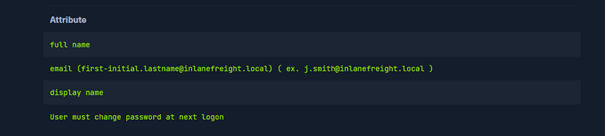
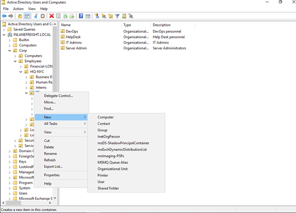

# Intro-to-Active-Directory
I guided project implemented on HackTheBox Academy.

It wasn't possible to show everything I done in lab so it's a summary of what I have done.

**Task 1 - Manage Users**

I had to manage following users:

So I started adding users:

I used a Windows PowerShell to add first user.

Next users I added using Active Directory GUI:

I changed the settings that users have to change their passwords at next logon.

Now I am gonna remove users using GUI:

By clicking "Delete" I will delete user "Paul Valencia".

Next I will reset Adam's password:

Using "reset password" I was able to reset Adam's password.

I also unlocked his account:

**Task 2 - Manage Groups and Other Organizational Units**

Ss of my task:

Let's get to creating new Organization Unit (OU):

I am choosing "Organization Unit".

Then I clicked New -> Group and created new group. I chose a "Domain local" scope for this group and clicked "Security group".

After this I added previously added workers to this group:

**Task 3 - Manage Group Policy Objects**

I got to Group Policy Management Editor:

Then I changed Removable Storage Access settings:

I configured "Deny all access" for all Removable Storage Classes.

After this I enabled all setting for Interactive Logon.

Using following command I connected Group Policy Object to the group created before.

**Task 4 - Add Computer to the Domain**

It was a short task. Using Control Panel I added my computer to the domain "INLANEFREIGHT.LOCAL":

That's everything. This guided labs were only part of the module on HackTheBox Academy. It was preceded by a lot of theory.

Thank you for following to the end! :D
